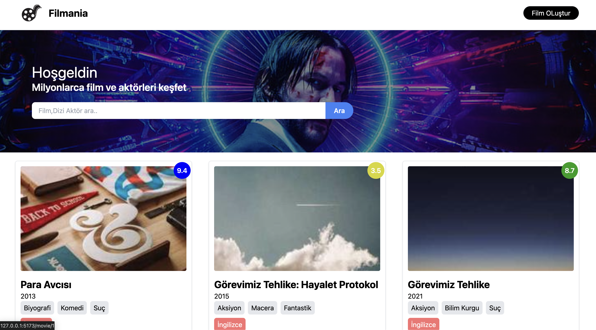
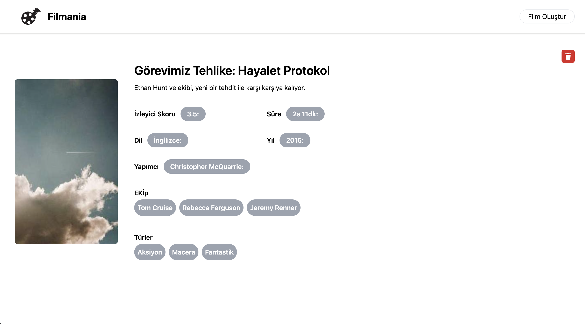
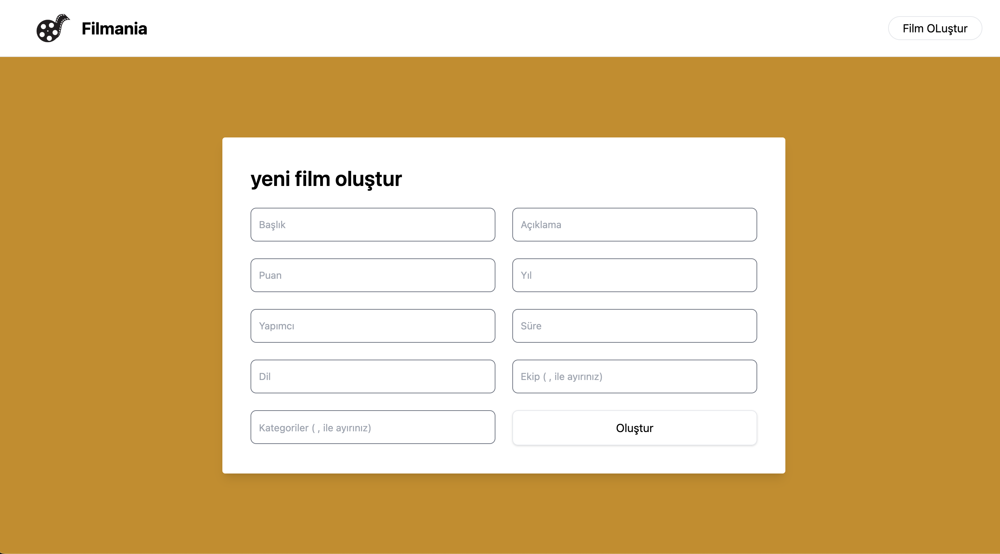

# Full_stack_movie_app

Full_stack_movie_app is a fully-featured movie application that allows users to browse, search for, add, and access detailed information about various films. Developed using modern technologies, this application stands out with its user-friendly interface and real-time data processing features.

### Video gif


## Screenshots

### Main Page



### Detail Page



### Create Page



## Features

- Main Page: View a list of movies and perform filtering and searching.
- Detail Page: View detailed information about each movie.
- Create Page: Add new movies and save them to the database.
- Movie Filtering: Search by movie titles and filter based on various criteria.
- User-Friendly Interface: An intuitive and responsive design optimized for both desktop and mobile devices.
- Error Handling: Loading states and API errors are communicated to the user with meaningful messages.
- Real-Time Data Processing: Data fetching and caching operations are managed effectively with React Query.
- Notifications: Notifications are shown for user interactions

## Technologies and Libraries Used

### Frontend

- React: For building user interfaces.
- Tailwind CSS: For styling and responsive design.
- React Router DOM: For page navigation.
  React Icons: For icons.
- Axios: For making HTTP requests.
- @tanstack/react-query: For data fetching and caching.
- React Toastify: For notifications.

### Backend

- Node.js: As the runtime environment.
- Nodemon: A development tool for automatically restarting the server.

## API Endpoints

| HTTP Method | Endpoint                 | Description                       |
| ----------- | ------------------------ | --------------------------------- |
| GET         | `/api/movies`            | Returns all movies                |
| GET         | `/api/movies/:id`        | Returns a specific movie          |
| GET         | `/api/movies?query=text` | Filters movies based on the query |
| DELETE      | `/api/movies/:id`        | Deletes a specific movie          |

### Endpoint Descriptions

- **GET `/api/movies`**

  - **Description:** Returns a list of all movies.
  - **Example Request:**
    ```bash
    GET http://localhost:5000/api/movies
    ```
  - **Example Response:**
    ```json
    [
      {
        "id": "1",
        "title": "Movie Title",
        "description": "Movie description",
        "posterUrl": "http://example.com/poster.jpg"
      },
      ...
    ]
    ```

- **GET `/api/movies/:id`**

  - **Description:** Returns details of a specific movie by the given `id`.
  - **Example Request:**
    ```bash
    GET http://localhost:5000/api/movies/1
    ```
  - **Example Response:**
    ```json
    {
      "id": "1",
      "title": "Movie Title",
      "description": "Movie description",
      "posterUrl": "http://example.com/poster.jpg"
    }
    ```

- **GET `/api/movies?query=text`**

  - **Description:** Filters movies based on the specified query parameter.
  - **Example Request:**
    ```bash
    GET http://localhost:5000/api/movies?query=Action
    ```
  - **Example Response:**
    ```json
    [
      {
        "id": "2",
        "title": "Action Film",
        "description": "Action-packed film",
        "posterUrl": "http://example.com/action.jpg"
      },
      ...
    ]
    ```

- **DELETE `/api/movies/:id`**
  - **Description:** Deletes a movie by the given `id`.
  - **Example Request:**
    ```bash
    DELETE http://localhost:5000/api/movies/1
    ```
  - **Example Response:**
    ```json
    {
      "message": "Movie deleted successfully."
    }
    ```

## Requirements

To run this project locally, you will need:

- Node.js: Download Node.js
- Expo CLI:
- A package manager (e.g., npm or yarn)

## Installation

- Clone the project to your local machine:

```
 git clone https://github.com/ozerbaykal/Full_Stack_Movie_App.git
```

- Navigate to the project directory:

```
cd Full_stack_movie_app

```

- Install the necessary packages:

```
cd backend
npm install

```

```
cd backend
npm install

```

- Start the Backend Server:

```
cd backend
nodemon start

```

- Start the Frontend Development Server:

```
cd frontend
npm run dev
```

<h2>Contributing</h2>

Contributions are welcome! Please open an issue first to discuss what you would like to change.

- 1.Fork the project
- 2.Create your feature branch (git checkout -b feature/NewFeature)
- 3.Commit your changes (git commit -m 'Add new feature')
- 4.Push to the branch (git push origin feature/NewFeature)
- 5.Open a Pull Request

<h2>Contact</h2>

Özer BAYKAL mail : baykalozer87@gmail.com
